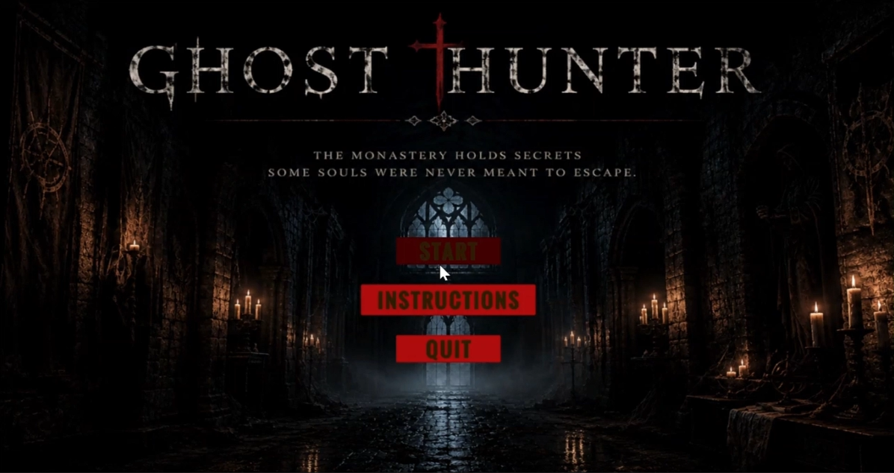
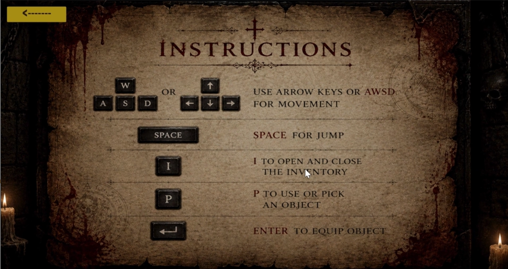
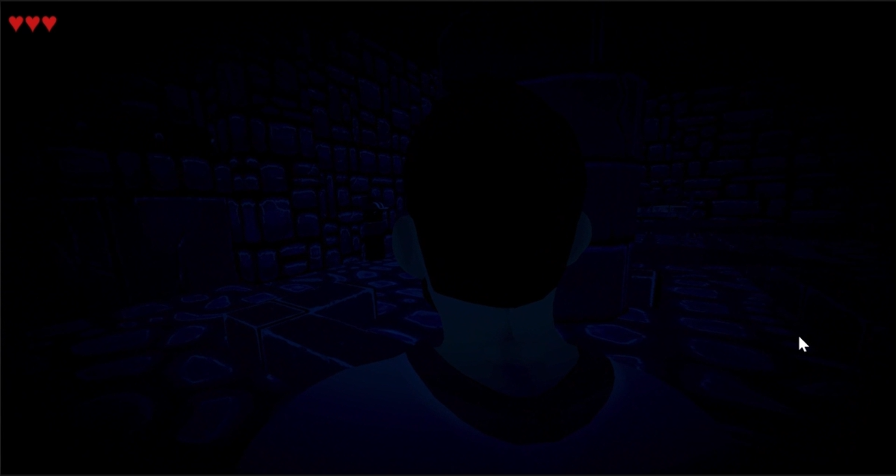
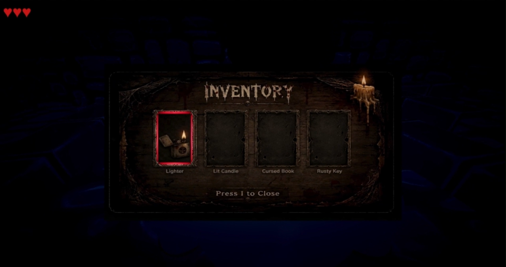
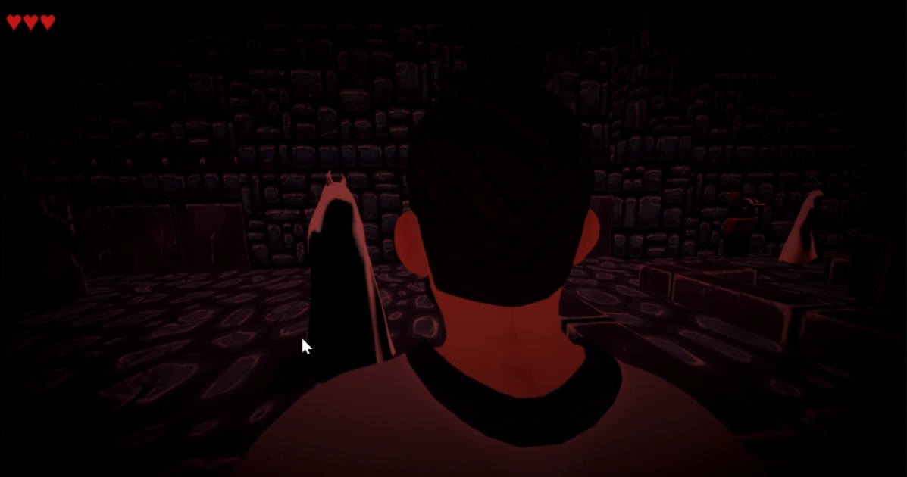

# 👻 Ghost Hunter

<p align="center">
  <b>A First-Person Horror Puzzle Game built with Unity 6 & C#</b>
  <br><br>
  Explore a haunted monastery, uncover hidden clues, solve environmental puzzles, and escape before the spirits claim you.
</p>

---

## 📖 Overview

**Ghost Hunter** is a first-person horror puzzle game developed in **Unity 6** using **C#**.

The player explores an abandoned monastery filled with supernatural entities, hidden clues, and challenging puzzles. Progress depends on observation, exploration, and using collected items to unlock new areas while avoiding dangerous ghosts.

This project was created to learn Unity game development, gameplay programming, UI design, scene management, and interactive game mechanics.

---

# 🎮 Gameplay

Your objective is simple:

> **Explore → Collect → Solve → Survive → Escape**

Throughout the game you will:

- Search rooms for clues
- Collect important items
- Solve environmental puzzles
- Unlock new areas
- Avoid hostile ghosts
- Escape the monastery

---

# ✨ Features

- 👻 First-person horror exploration
- 🎒 Inventory & equipment system
- 🔍 Interactive clue collection
- 🧩 Puzzle-based progression
- ⚠️ Ghost proximity warning system
- ❤️ Three-life health system
- 🚪 Interactive objects and environment
- 🎵 Background music & sound effects
- 🖥️ Main Menu, Instructions & Game Over screens

---

# 🛠 Tech Stack

| Technology | Purpose |
|------------|---------|
| Unity 6 | Game Engine |
| C# | Gameplay Programming |
| Unity Animation System | Character Animation |
| Unity UI Toolkit / Canvas UI | User Interface |
| Git | Version Control |
| GitHub | Project Hosting |

---

# 🎮 Controls

| Action | Key |
|---------|-----|
| Move | **W A S D** |
| Jump | **Space** |
| Open / Close Inventory | **I** |
| Pick Up / Interact | **P** |
| Equip Selected Item | **Enter** |

---

# 🎥 Gameplay Demo

Watch the gameplay here:

**▶️ Google Drive Video**

(https://drive.google.com/file/d/1pG6wQS_u11Go3ApgCyQ0AUCy5afaFXLz/view?usp=sharing)

---

# 📸 Screenshots

## 🏠 Main Menu



---

## 📖 Instructions



---

## 🎮 Gameplay



---

## 🎒 Inventory System



---

## 👻 Ghost Encounter



---

# 🏗 Game Flow

```text
Start Game
      │
      ▼
 Main Menu
      │
      ▼
 Instructions
      │
      ▼
 Spawn Inside Monastery
      │
      ▼
 Explore Environment
      │
      ▼
 Collect Clues & Items
      │
      ▼
 Solve Puzzles
      │
      ▼
 Avoid Ghosts
      │
      ▼
 Manage Health & Inventory
      │
      ▼
 Escape the Monastery
      │
      ▼
   Game Complete
```

---

# 📂 Project Structure

```text
Ghost Hunter
│
├── Assets/
├── Packages/
├── ProjectSettings/
├── Screenshots/
│   ├── Scene1.png
│   ├── Scene2.png
│   ├── Scene3.png
│   ├── Scene4.png
│   └── Scene5.png
├── README.md
└── ...
```

---

# 🚀 Key Gameplay Systems

This project includes the implementation of:

- First-person character controller
- Inventory management system
- Item pickup mechanics
- Equipment selection system
- Interactive clue collection
- Environmental puzzles
- Ghost AI interactions
- Ghost warning effects
- Health management
- Scene transitions
- Menu system
- Audio integration
- Game Over system

---

# 📚 Learning Outcomes

Through this project, I gained practical experience with:

- Unity Engine fundamentals
- C# scripting
- Object-oriented programming
- Gameplay mechanics
- Player interaction systems
- Inventory design
- UI development
- Scene management
- Audio implementation
- Debugging
- Git & GitHub workflow

---

# 🚧 Future Improvements

Planned enhancements include:

- Better Ghost AI
- Multiple levels
- Save & Load system
- More environmental puzzles
- Better lighting effects
- Improved sound design
- Difficulty modes
- Checkpoint system

---

# 👨‍💻 Author

**Kiren Saleem**

This project was developed as my first complete Unity game to practice game development concepts, gameplay programming, puzzle mechanics, UI implementation, and interactive system design.

---

## ⭐ Support

If you enjoyed this project or found it helpful, consider giving the repository a **⭐ Star**.

Feedback and suggestions are always welcome!
